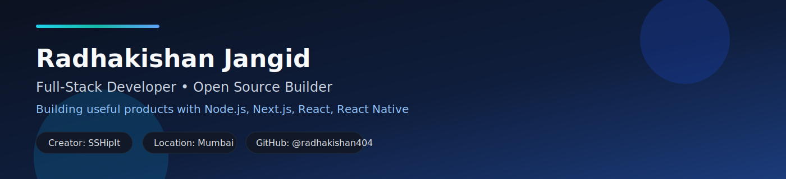

<h1 align="center">Hi, I'm Radhakishan Jangid 👋</h1>

  <b>Full-Stack Developer • Open-Source Builder • Shipping practical products fast</b>

  

  
  
  
  

  

---

## 🚀 About Me

- 📍 Based in **Mumbai, India**
- 🛠️ Building practical tools for real-world deployment and developer productivity
- 🔐 Big fan of **self-hosted systems**, **clean automation**, and **simple UX**
- 🌱 Currently focused on making **SSHipIt** better for production teams
- 🤝 Open to collaboration on Node.js, Next.js, React, and React Native projects

---

## 🧰 Tech Stack

  
  
  
  
  
  
  
  
  
  
  
  

---

## 🌟 Featured Open-Source Projects

| Project | What it does | Stack |
|---|---|---|
| [**SSHipIt**](https://github.com/radhakishan404/sshipit) | Self-hosted CI/CD over SSH for Node.js/Next.js/React deployments | Node.js, Express, SQLite, WebSocket, SSH |
| [**react-native-stylish-accordion**](https://github.com/radhakishan404/react-native-stylish-accordion) | Customizable accordion component for React Native | React Native |
| [**react-native-stylish-notification-alert**](https://github.com/radhakishan404/react-native-stylish-notification-alert) | Animated notification alert package | React Native |
| [**billing-software**](https://github.com/radhakishan404/billing-software) | Lightweight billing software project | Web App |
| [**Health-Monitoring-System-Live-Chat**](https://github.com/radhakishan404/Health-Monitoring-System-Live-Chat) | Health monitoring + live chat system | Full-stack JavaScript |
| [**candidate-cv-builder-api**](https://github.com/radhakishan404/candidate-cv-builder-api) + [frontend](https://github.com/radhakishan404/candidate-cv-builder-react) | CV builder backend and frontend repos | Node.js + React |

> More projects: [github.com/radhakishan404?tab=repositories](https://github.com/radhakishan404?tab=repositories)

---

## 📈 GitHub Stats

  
  

  

  

---

## 🧭 Current Focus

- Make **SSHipIt** a go-to lightweight deploy platform
- Improve deployment UX for multi-project teams
- Keep contributing reusable React Native components

---

## 📫 Connect With Me

  
  
  

---

<i>Build useful things. Ship fast. Improve constantly.</i>

