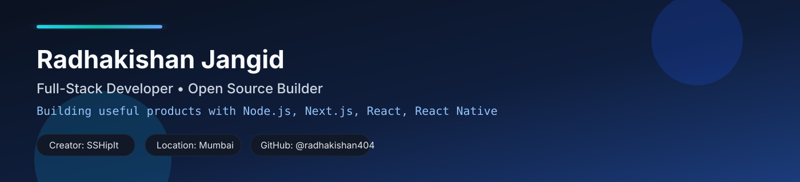

<!-- GITHUB PROFILE README — radhakishan404 -->

<p align="center">
  
</p>

<div align="center">

<a href="https://radhakishan404.github.io/">
  
</a>

<br/>


<br/><br/>

[](https://radhakishan404.github.io/)
[](https://www.linkedin.com/in/radhakishanjangid)
[](mailto:radhakishanjangid404@gmail.com)
[](https://github.com/radhakishan404)
[](https://dev.to/radhakishanjangid404)

<br/>


<a href="https://github.com/radhakishan404?tab=followers"></a>


</div>

---

## 🧭 About

I'm **Radhakishan Jangid**, a Senior Software Engineer with **7+ years** building production web and mobile products end to end — from the React UI down to the Node.js / PHP APIs and the deployment that ships them. I currently work with US-based product and engineering teams at **Cachetech Advisor Solutions**, building scalable fintech systems: workflow management, multi-tenancy architecture, and React Native mobile delivery.

I care about systems that stay maintainable as they grow — feature-modular React, clean REST boundaries, and CI/CD that removes humans from the deploy path. Lately I'm **building in public** with native macOS tools and open-source developer utilities.

```txt
🔭  Currently Building — MacEdits (macOS reel editor) · SSHipIt (CD over SSH)
🌱  Currently Exploring — SwiftUI / AVFoundation, native macOS app architecture
💬  Open To          — collaboration on Node.js, Next.js, React & React Native
```

---

## 🛠️ Tech Stack

**Languages**

<p>

</p>

**Frontend & Mobile**

<p>


</p>

**Backend & Databases**

<p>


</p>

**DevOps & Cloud**

<p>


</p>

---

## 🚀 Featured Projects

<details>
<summary><b>🔷 MacEdits</b> — local-first macOS reel editor for creators</summary>
<br/>

**Architecture:** A backend-free SwiftUI desktop app where recording, timeline editing, and export run entirely on-device via AVFoundation and ScreenCaptureKit — no cloud dependency in the creator workflow.

| Dimension | Detail |
|-----------|--------|
| Stack | Swift, SwiftUI, AVFoundation, ScreenCaptureKit, macOS |
| Scope | Recording studio (camera / screen / both), timeline trim·split·reorder·ripple, captions & export |
| Model | Local-first — all media processing on-device |
| Status | Open Source · Build in Public (2026) |

**What I Learned:** Driving real-time media pipelines through AVFoundation forces you to think in time samples and buffer lifecycles rather than request/response — a very different mental model from web engineering.

[](https://github.com/radhakishan404/MacEdits)

</details>

<details>
<summary><b>🔷 SSHipIt</b> — continuous deployment over SSH for Node / Next.js / React</summary>
<br/>

**Architecture:** A self-hosted CD utility that runs reliable deployment pipelines over plain SSH, giving small teams a CI/CD pattern without locking into a managed platform.

| Dimension | Detail |
|-----------|--------|
| Stack | Node.js, Express, SSH, WebSocket, CI/CD |
| Targets | Node.js, Next.js, React applications |
| Value | Simple, self-hosted deploys — no platform lock-in |
| Status | Open Source · Live (2026) |

**What I Learned:** Designing for other developers' machines means defensive defaults and clear failure output matter more than feature count — the tool has to fail loudly and recover predictably.

[](https://sshipit.vercel.app/) [](https://github.com/radhakishan404/sshipit)

</details>

<details>
<summary><b>🔷 Notch Prompter</b> — notch-aligned native macOS teleprompter</summary>
<br/>

**Architecture:** A native SwiftUI utility that positions a teleprompter against the MacBook notch, with a clean reading layout tuned for creators recording to camera.

| Dimension | Detail |
|-----------|--------|
| Stack | Swift, SwiftUI, macOS |
| Focus | Notch-aligned reading layout, minimal interaction model |
| Status | Open Source · Live (2026) |

**What I Learned:** Constraining the UI to the notch region turned a layout limitation into the product's defining feature — sometimes the constraint *is* the design.

[](https://notch-prompter.vercel.app) [](https://github.com/radhakishan404/notch-prompter)

</details>

<details>
<summary><b>🔷 Nirula's — Online Ordering + POS</b> — high-traffic React/Node food delivery platform</summary>
<br/>

**Architecture:** Migrated a legacy AngularJS storefront to a feature-modular React + Redux frontend backed by Node.js/Express APIs, with lazy-loaded modules and a dedicated customization/pricing service for menu items.

| Dimension | Detail |
|-----------|--------|
| Stack | React, Redux, Node.js, Express, AWS, Google Analytics |
| Scope | Storefront + branch POS: cart, coupons, OTP, live location, branch dashboards |
| Engineering | Per-feature module split, lazy loading, server-side pricing/customization |
| Status | Live |

**What I Learned:** The hardest part wasn't the UI — it was modeling product customization and pricing so the same rules held across storefront and POS. Pushing that logic into a single Node API kept both clients consistent.

[](https://delivery.nirulas.com/)

</details>

<details>
<summary><b>🔷 Open-Source NPM Packages</b> — React / React Native components</summary>
<br/>

**Architecture:** A set of small, focused, published React/React Native packages — animation, accordion, and form-validation primitives — designed to drop into Expo apps with minimal config.

| Package | What it does |
|---------|--------------|
| [`react-animation-loader`](https://www.npmjs.com/package/react-animation-loader) | Animated loader with custom image & CSS transitions |
| [`react-native-stylish-accordion`](https://www.npmjs.com/package/react-native-stylish-accordion) | Configurable animated accordion for React Native |
| [`validate-form-in-expo-style`](https://www.npmjs.com/package/validate-form-in-expo-style) | Floating-label form validation for React Native |

**What I Learned:** Publishing for strangers raises the bar on API design — sensible defaults, typed props, and documentation are the difference between a package that gets used and one that gets abandoned.

[](https://www.npmjs.com/~radhakishanjangid)

</details>

> More projects → [github.com/radhakishan404?tab=repositories](https://github.com/radhakishan404?tab=repositories)

---

## 💼 Experience

### 🏢 Senior Software Engineer — **Cachetech Advisor Solutions (USA)** `Feb 2024 → Present`
> Building scalable fintech systems with US-based product and engineering teams.
- Deliver workflow management and **multi-tenancy architecture** for production fintech systems.
- Ship **React Native** mobile app features alongside the web product.

### 🏢 Manager – Software Engineer — **Edubridge India Pvt Ltd** `Dec 2022 → Jan 2024`
> Led platform modernization and the migration off legacy PHP.
- Led migration from **PHP to the MERN stack** and built a resume-builder platform.
- Shipped microservice-based products on **Jenkins + Docker** CI/CD pipelines.

### 🏢 Senior Software Engineer — **TechStalwarts Software Development LLP** `Sep 2020 → Nov 2022`
> Owned ecommerce delivery across the full stack for high-traffic systems.
- Delivered frontend, backend, and **AWS** deployments for production ecommerce platforms.
- Integrated third-party APIs (payments, analytics) into high-traffic flows.

### 🏢 PHP Web Developer — **Innovins Softtech Solutions** `Jul 2019 → Aug 2020`
> Maintained and extended enterprise portals and internal tooling.
- Built API and task-management features across multiple enterprise productivity systems.

<sub>Earlier: PHP / CodeIgniter Developer — IMPAQ Technologies (Aug 2018 → Jun 2019)</sub>

---

## 📊 GitHub Analytics

<p align="center">
  
  
</p>

<p align="center">
  
</p>


---

## 🌐 Connect

<div align="center">

[](mailto:radhakishanjangid404@gmail.com)
[](https://www.linkedin.com/in/radhakishanjangid)
[](https://x.com/radhakishan404)
[](https://www.instagram.com/rk.codex)
[](https://www.youtube.com/@rk-codex)

> Response time: typically within 24–48 hours.

</div>

---

<div align="center">

<i>"Build useful things. Ship fast. Improve constantly."</i>

</div>
